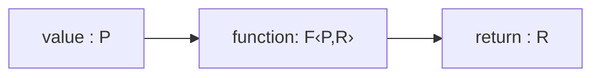
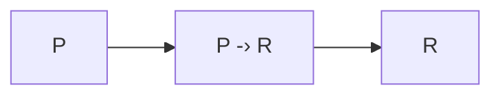
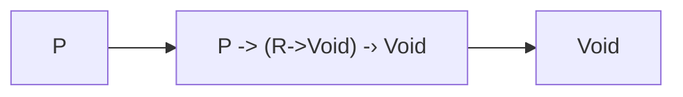

# Fletcher

Fletcher is an asycnhronous effect system and integrated scheduler based on how [arrowlets](https://www.cs.umd.edu/~mwh/papers/jsarrows.pdf) relate to the logical equivalency of threads and events.

A `Fletcher` can be described as a constructor for a continuation monad with the return `R` of `(A->R) -> R` constrained to return work for a scheduler. `P -> (R -> Work) -> Work`

Both the input value, the output value and the continuation monad are available to use with a comprehensive set of combinators which allow any combination of synchronous and asynchonous programs to
be connected in ways as powerful as a monad but [without the type system requirements](http://www.cse.chalmers.se/~rjmh/Papers/arrows.pdf).

Topics regarding interleaving functions and values over data streams and between processes are taken on in [stx_coroutine](https://github.com/ohmrun/stx_coroutine) and [stx_proxy](https://github.com/ohmrun/stx_proxy) which rely on this library for their cross platform async support.

```haxe
  using eu.ohmrun.Fletcher;
  class Main{
    static public function main(){
      //lift a function 
      final arr = Fletcher.Sync((i:Int) -> i + 1);
      //provide it's environment
      __.ctx(
        10,//input value
        x -> trace(x),//called on success with result
        e -> throw(e)//called on failure
      ).load(arr)//creates a `Fiber` to be sent to a scheduler
       .submit();//send to the asynchronous scheduler. Can use `crunch` to try and yield a value synchronously
    }
  }
```

## Struture

There's two APIs, the internal and external. The external is for general use and consists of constructors and combinators, and the internal is for writing your own combinators.

## External Api

### Basics

A function takes an input and transforms it to an output.


  


An arrowlet consumes a callback to handle the output at a later date



In either case, you can take the output of one and input it into another

### [`eu.ohmrun.fletcher.term.Then`](./src/main/haxe/eu/ohmrun/fletcher/term/Then.hx)
```mermaid
  %%{init: { "theme": "dark","flowchart": {"htmlLabels": false}} }%%
  flowchart LR
    PI["P"]
    RI["R"]
    PII["R"]
    RII["RI"]
    PIII["P"]
    RIII["RI"]

    subgraph F
    direction LR
    PI-->RI
    end
  
    subgraph G
    direction LR
    PII-->RII
    end

    subgraph =
    direction LR
    PIII-->RIII
    end
    F --> G --> =
```

### [`eu.ohmrun.fletcher.Modulate`](./src/main/haxe/eu/ohmrun/fletcher/Modulate.hx)

Modulate introduces `Upshot` as a return type, giving more functionality for error handling and is the basis of most of 
the combinators.

```mermaid
  %%{init: { "theme": "dark","flowchart": {"htmlLabels": false}} }%%
  flowchart LR
    PI["P"]
    EI["E"]
    EII["E"]

    PII["(P,E)"]
    RII["(R,E)"]


    subgraph =
    direction LR
    direction LR
    PI-->R
    EI-->R
    PI-->EII
    EI-->EII
    end

    subgraph Modulate
    direction LR
    PII --> RII
    end

    Modulate --> =
```


## Internal Api